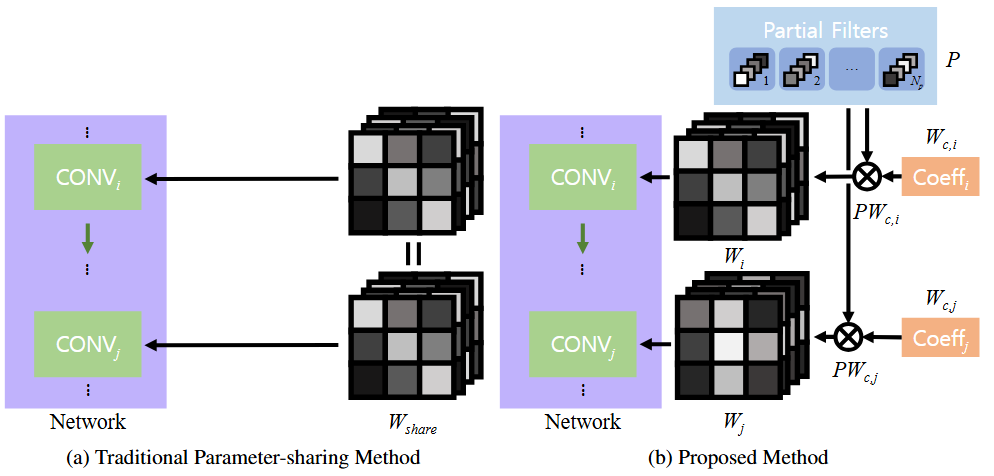
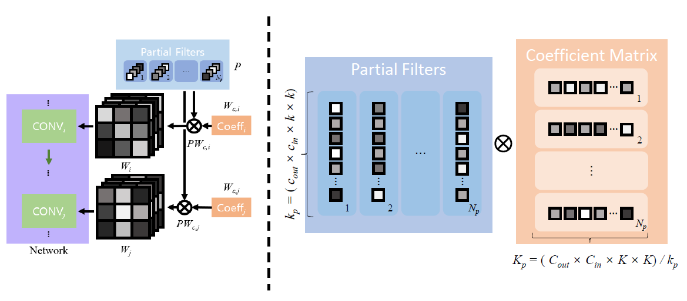
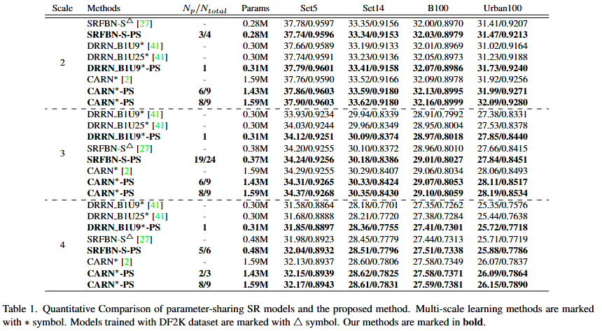
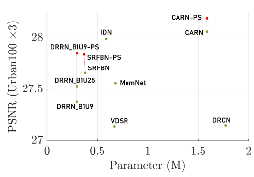
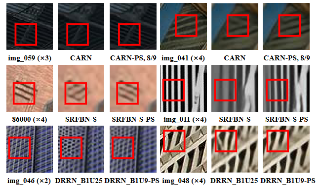

# Partial filter-Sharing

# Partial filter-Sharing: Improved Parameter-sharing Method for Single Image Super-Resolution Networks

Karam Park, Nam Ik Cho

Accepted for publication at WACV 2025

## Abstract

Numerous deep learning techniques have been developed for Single Image Super-Resolution (SISR), leading to significant performance improvements. However, these techniques have also resulted in a significant increase in parameter size. As a result, there is a growing interest in reducing network complexity for more practical usage while still maintaining SR quality. One such method is parameter-sharing, which involves recursive and recurrent structures, as well as multi-scale learning approaches. However, sharing identical kernels across layers or up-scale tasks can weaken the network's representational capacity. To address this, we propose Partial filter-Sharing (PS), a new parameter-sharing method that maintains the network's representational power more effectively than previous methods. Instead of sharing a single filter, PS shares pieces of filters, called partial filters, among the layers. This approach allows parameter-sharing layers to use diverse filters in each layer or task, balancing parameter efficiency and the network's representational ability without causing an excessive parameter and computational burden. Furthermore, the PS framework provides precise control over the network's performance and complexity by adjusting the quantities of partial filters. Extensive experiments have demonstrated that our PS framework outperforms traditional parameter-sharing super-resolution (SR) methods without excessive additional parameters or computational load.

## Proposed Method

### Comparison of the traditional parameter-sharing method and the proposed method

In conventional approaches, parameter-sharing layers execute convolution operations using a limited set of filters. In contrast, our approach utilizes partial filters and coefficient matrices, enabling the reconstruction of diverse filters tailored for each layer. This diversity in filters enriches the network's representations and enhances its performance.

### Visualized explanation of the proposed method

In this paper, we introduce a new approach called Partial filter-Sharing (PS) to overcome the limitations of previous parameter-sharing SR methods. PS utilizes a novel filter assignment strategy that involves using fragments of filters, which we refer to as partial filters. To reconstruct the weights of convolution layers from these partial filters, network layers employ the coefficient matrix, containing the information necessary for merging partial filters into complete filters. By using coefficient matrices, the network can take advantage of parameter-sharing while also using a variety of filters for each layer or scale. This approach reduces the risk of compromising representational ability due to reduced parameters, a common issue in traditional parameter-sharing methods.

## Experimental Results

### Quantitative Results

The results are evaluated with the average PSNR (dB) and SSIM on the Y channel of the YCbCr colorspace.

### Visualized Results

## Codes

[CARN-PS & DRRN-PS](https://github.com/saturnian77/CARN_DRRN-PS)

[SRFBN-PS](https://github.com/saturnian77/SRFBN-PS)
